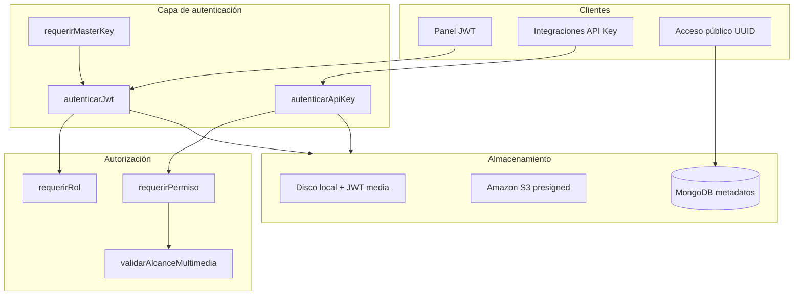

# Informe de seguridad — gestion-archivo-backend

**Proyecto:** Orion Marketplace — File Management API (`gestion-archivo-backend`)  
**Fecha:** 28 de mayo de 2026  
**Versión analizada:** rama de trabajo local (Express 5, Node.js, MongoDB, S3/local)  
**Tipo de revisión:** auditoría estática del código fuente (sin pruebas de penetración)

---

## 1. Resumen ejecutivo

El backend implementa una **base de seguridad sólida** para un servicio de gestión de archivos multi-tenant: autenticación JWT, contraseñas con bcrypt, API keys almacenadas como hash, roles (`admin` / `cliente`), aislamiento por cliente en almacenamiento y controles básicos en uploads.

Sin embargo, **no está listo para producción expuesta a internet sin endurecimiento adicional**. Los principales riesgos son:

| Severidad | Cantidad | Tema principal |
|-----------|----------|----------------|
| Crítica   | 2        | Modo legado sin autenticación; carpeta `/media` pública |
| Alta      | 4        | Prefijos de API key no aplicados en escritura/lectura; CORS abierto; sin rate limiting |
| Media     | 5        | Registro público sin límite; Swagger expuesto; JWT sin revocación |
| Baja      | 4        | Hash SHA-256 de API keys; comparación de master key; tests ausentes |
| Informativa | 3      | Decisiones de diseño del panel JWT; auditoría con TTL |

**Veredicto:** Aceptable para **desarrollo y entornos internos** con MongoDB y secretos bien configurados. Para **producción pública**, aplicar el plan de remediación de la sección 8 antes del go-live.

---

## 2. Alcance

### Incluido

- Código en `src/` (rutas, middlewares, servicios, modelos)
- Configuración en `src/config/` y `.env.example`
- Flujos de autenticación, autorización, multimedia y administración

### Excluido

- Infraestructura (TLS, firewall, WAF, MongoDB Atlas, IAM AWS)
- Frontends (`gestion-archivo-front`, `front-orion-marketplace`)
- Pruebas dinámicas, fuzzing o pentest
- Dependencias desactualizadas (no se ejecutó `npm audit`)

---

## 3. Arquitectura de seguridad

### Mecanismos de acceso

| Mecanismo | Uso | Secreto / credencial |
|-----------|-----|----------------------|
| JWT Bearer (`tipo: auth`) | Login panel admin/cliente | `JWT_AUTH_SECRET` |
| API Key (`X-API-Key` o Bearer) | Integraciones servidor-a-servidor | Hash SHA-256 en BD |
| Master Key (`X-Master-Key`) | Bootstrap `POST /auth/register` | `MASTER_API_KEY` |
| JWT media (`/multimedia/acceso/:token`) | Enlaces temporales local | `JWT_MEDIA_SECRET` |
| UUID público | Archivos marcados `publico` | Sin auth (solo metadatos) |

---

## 4. Controles implementados (fortalezas)

### 4.1 Autenticación de usuarios

- Contraseñas hasheadas con **bcrypt**, factor **12** (`authService.js`, `migrateSeedAdminUser.js`).
- Validación mínima de contraseña: **8 caracteres**.
- JWT de login incluye claim `tipo: 'auth'`; tokens de otro tipo se rechazan (`autenticarJwt.js`).
- En cada petición autenticada se **recarga el usuario desde BD** y se verifica `activo`.
- Mensaje genérico en login fallido: *"Credenciales inválidas"* (no confirma si el email existe).
- Registro de admin protegido por **`X-Master-Key`** (`auth.routes.js` → `requerirMasterKey`).
- Registro de clientes (`register-client`) crea cuenta **`activo: false`** hasta activación admin.

### 4.2 API keys

- Claves generadas con `crypto.randomBytes(32)` → prefijo `orion_` + 64 hex (`hashApiKey.js`).
- Solo se persiste **hash SHA-256**; la clave en claro se devuelve una vez al crear/rotar.
- Permisos granulares: `read`, `write`, `delete` (modelo `ApiKey`).
- Rotación y desactivación de llaves; registro de `ultimoUsoAt`.
- Tenant resuelto desde la API key (no se confía en `clienteId` del body en rutas de integración).

### 4.3 Autorización por roles

- Rutas `/api/v1/admin/*`: `autenticarJwt` + `requerirRol('admin')`.
- Rutas `/api/v1/client/*`: `autenticarJwt` + `requerirRol('cliente')`.
- Admin puede operar sobre cualquier cliente; cliente solo sobre su propio tenant.

### 4.4 Multimedia y archivos

- **Whitelist de MIME** (`config/multimedia.js`): imágenes, PDF, Office, OpenDocument.
- Límite de tamaño configurable (`UPLOAD_MAX_MB`, default 5 MB).
- Validación de segmentos de ruta (slugs, tipos de carpeta, IDs).
- Protección **anti path traversal** (`asegurarDentroDeUploads`, rechazo de `..` en rutas).
- Aislamiento físico/lógico: `clients/{clienteId}/...`.
- Acceso público solo vía `GET /multimedia/publico/:publicId` con `visibilidad: 'publico'`.
- URLs firmadas con TTL acotado (60–86400 s) para S3 y JWT local.
- Auditoría de operaciones sensibles (subida, borrado, url-firma, API keys) con TTL en MongoDB.

### 4.5 HTTP y errores

- **Helmet** activo (`app.js`).
- Stack trace solo fuera de producción (`errorHandler.js`).
- Validación de entorno al arrancar: con `MONGODB_URI` exige `JWT_AUTH_SECRET` y `JWT_MEDIA_SECRET` (local).

---

## 5. Matriz de endpoints públicos

| Endpoint | Auth | Riesgo si mal configurado |
|----------|------|---------------------------|
| `GET /health` | Ninguna | Bajo (info de estado) |
| `GET /api`, `/api/v1` | Ninguna | Bajo (descubrimiento de API) |
| `GET /api/docs`, `/api/docs.json` | Ninguna | Medio (superficie de ataque documentada) |
| `GET /api/v1/products` | Ninguna | Bajo (stub público) |
| `POST /api/v1/auth/login` | Ninguna | Alto sin rate limit |
| `POST /api/v1/auth/register-client` | Ninguna | Medio (spam de cuentas inactivas) |
| `POST /api/v1/auth/register` | Master Key | Bajo si master key es fuerte |
| `GET /multimedia/publico/:publicId` | Ninguna | Bajo (solo archivos `publico`) |
| `GET /multimedia/acceso/:token` | Token JWT media | Bajo (TTL + firma) |
| `GET /media/*` | Ninguna | **Crítico** (solo modo legado sin Mongo) |
| `/api/v1/multimedia/*` (resto) | API Key | Depende de permisos y alcance |
| `/api/v1/admin/*` | JWT admin | Bajo con secretos fuertes |
| `/api/v1/client/*` | JWT cliente | Bajo–medio (panel sin llave = acceso amplio) |

---

## 6. Hallazgos de seguridad

### 6.1 Críticos

#### C-01 — Modo legado sin API key = acceso anónimo total

**Ubicación:** `src/middleware/autenticarApiKey.js` → `legacyAutenticar`

Si **no** hay `MONGODB_URI` y **no** hay `API_KEY`, todas las rutas de multimedia aceptan peticiones sin credenciales.

**Impacto:** Lectura, subida y borrado de archivos sin autenticación.

**Recomendación:** Eliminar el bypass cuando `!config.apiKey`; fallar con 503 o 401. Usar MongoDB en cualquier entorno no local.

---

#### C-02 — Carpeta `/media` servida como estática pública (modo legado)

**Ubicación:** `src/app.js` (líneas 48–53)

Con `STORAGE_DRIVER=local` y sin `MONGODB_URI`, Express monta `express.static` en `/media`.

**Impacto:** Cualquier archivo subido es accesible por URL directa sin token.

**Recomendación:** No usar este modo en producción. Servir archivos solo vía tokens firmados o S3 con políticas restrictivas.

---

### 6.2 Altos

#### A-01 — Prefijos de API key no aplicados en write/delete/list por ruta

**Ubicación:** `src/middleware/validarAlcanceMultimedia.js`

La función `validarAlcanceMultimedia` es un **no-op** en modo MongoDB. Una API key con permiso `write` puede operar en **cualquier ruta del tenant**, no solo en sus `prefijos`.

**Impacto:** Una llave comprometida o mal configurada tiene alcance mayor al esperado.

**Recomendación:** Aplicar `alcanzaPrefijosEscritura` y `validarAlcanceRutaCliente` en POST, DELETE y `url-firma`.

---

#### A-02 — `POST /multimedia/url-firma` sin validación de prefijos

**Ubicación:** `src/routes/api/v1/multimedia.routes.js`, `multimediaController.solicitarUrlFirma`

Con permiso `read`, una API key puede solicitar URL firmada de **cualquier archivo del tenant**.

**Impacto:** Escalada de lectura dentro del tenant; bypass del modelo de prefijos.

**Recomendación:** Validar que `rutaInternaCliente` esté dentro de los prefijos de la llave (y/o pertenezca a la llave vía metadatos `apiKey`).

---

#### A-03 — CORS abierto a cualquier origen

**Ubicación:** `src/app.js` → `app.use(cors())`

**Impacto:** Cualquier sitio web puede hacer peticiones cross-origin desde el navegador del usuario (si combina con cookies o tokens expuestos).

**Recomendación:** Configurar `origin` con lista blanca de dominios del front (`CORS_ORIGINS` en env).

---

#### A-04 — Sin rate limiting en autenticación y registro

**Endpoints afectados:** `/auth/login`, `/auth/register-client`, `/auth/register`

**Impacto:** Fuerza bruta de contraseñas, enumeración, DoS por registros masivos.

**Recomendación:** `express-rate-limit` o limitación en reverse proxy (nginx, Cloudflare, API Gateway).

---

### 6.3 Medios

#### M-01 — Panel JWT opera sin restricciones de llave API

**Ubicación:** `src/middleware/requerirPermiso.js`, `validarAlcancePanelJwt.js`

Si el usuario del panel no envía `X-Llave-Id`, se omiten permisos de API key y alcance por prefijos.

**Impacto:** Comportamiento esperado para “dueño del tenant”, pero no hay permisos finos en el panel.

**Recomendación:** Documentar explícitamente; opcionalmente exigir llave en operaciones destructivas.

---

#### M-02 — Registro público de clientes sin CAPTCHA ni verificación de email

**Ubicación:** `POST /api/v1/auth/register-client`

**Impacto:** Spam de cuentas inactivas, carga en BD, posible abuso operativo.

**Recomendación:** Rate limit estricto, CAPTCHA, verificación de email o desactivar en producción.

---

#### M-03 — Swagger UI expuesto sin autenticación

**Ubicación:** `/api/docs`, `/api/docs.json`

**Impacto:** Facilita reconocimiento de la API a atacantes.

**Recomendación:** Deshabilitar en `NODE_ENV=production` o proteger con auth básica / IP allowlist.

---

#### M-04 — JWT sin revocación ni refresh token

**Ubicación:** `authService.firmarToken`

**Impacto:** Token robado válido hasta expiración (`JWT_AUTH_EXPIRES_IN`, default 1h).

**Recomendación:** TTL corto + refresh token rotativo, o blacklist en Redis para logout forzado.

---

#### M-05 — Clientes pueden crear API keys con permiso `delete`

**Ubicación:** `clienteSelfServiceController.crearMiLlave`

**Impacto:** Usuario comprometido puede generar llaves de alto privilegio.

**Recomendación:** Limitar permisos que un cliente puede auto-asignarse; aprobación admin para `delete`.

---

### 6.4 Bajos

#### B-01 — API keys hasheadas con SHA-256 (rápido)

**Ubicación:** `hashApiKey.js`

Las claves son largas y aleatorias (mitiga brute force offline), pero SHA-256 es más rápido que bcrypt/argon2.

**Recomendación:** Mantener longitud actual; considerar HMAC con pepper de servidor si el modelo evoluciona.

---

#### B-02 — Comparación de Master Key susceptible a timing attack

**Ubicación:** `requerirMasterKey.js` → comparación `!==`

**Recomendación:** `crypto.timingSafeEqual` sobre buffers de igual longitud.

---

#### B-03 — Sin límite explícito en `express.json()`

**Ubicación:** `app.js`

Express 5 tiene límite por defecto (~100 KB). Documentar o fijar `limit` explícito.

---

#### B-04 — Sin suite de tests de seguridad

**Ubicación:** `package.json` → `"test": "echo ... exit 1"`

**Recomendación:** Tests de integración para auth, alcance, path traversal y uploads maliciosos.

---

### 6.5 Informativos

#### I-01 — Productos stub públicos

`GET /api/v1/products` no requiere auth. Datos de ejemplo; riesgo bajo.

#### I-02 — Auditoría con retención 30 días (configurable)

Eventos sensibles se registran; TTL por `AUDITORIA_TTL_DIAS`. Adecuado para operación, insuficiente para compliance largo plazo.

#### I-03 — Vercel + almacenamiento local

`ensureServerReady.js` advierte que `/tmp` no persiste. Riesgo operativo, no de confidencialidad directa.

---

## 7. Checklist de configuración para producción

| Variable / control | Obligatorio | Notas |
|--------------------|-------------|-------|
| `NODE_ENV=production` | Sí | Oculta stack traces |
| `MONGODB_URI` | Sí | No usar modo legado |
| `JWT_AUTH_SECRET` | Sí | ≥ 32 bytes aleatorios |
| `JWT_MEDIA_SECRET` | Sí (local) | Distinto de auth secret |
| `MASTER_API_KEY` | Sí | Solo para bootstrap; rotar si filtra |
| `STORAGE_DRIVER=s3` | Recomendado | En Vercel/prod |
| `S3_BUCKET` + IAM mínimo | Si S3 | Solo permisos necesarios |
| `UPLOAD_MAX_MB` | Sí | Ajustar según negocio |
| `SIGNED_URL_EXPIRES_SECONDS` | Sí | Default 900 s razonable |
| CORS restringido | Sí | Implementar en código |
| Rate limiting | Sí | Login y registro |
| Swagger deshabilitado | Recomendado | O protegido |
| TLS (HTTPS) | Sí | En reverse proxy |
| `.env` fuera de git | Sí | Ya documentado en `.env.example` |
| `npm run migrate:admin` | Sí | Admin inicial seguro |
| Backups MongoDB | Sí | Operaciones |

---

## 8. Plan de remediación priorizado

| Prioridad | Acción | Esfuerzo estimado |
|-----------|--------|-------------------|
| P0 | Desactivar modo legado sin auth; no montar `/media` en prod | 2–4 h |
| P0 | CORS con lista blanca | 1–2 h |
| P1 | Rate limiting en `/auth/*` | 2–3 h |
| P1 | Aplicar validación de prefijos en write/delete/url-firma | 4–8 h |
| P1 | Ocultar Swagger en producción | 1 h |
| P2 | CAPTCHA o deshabilitar `register-client` en prod | 2–4 h |
| P2 | Refresh token + revocación | 1–2 días |
| P2 | Tests de seguridad automatizados | 2–3 días |
| P3 | `timingSafeEqual` en master key | 30 min |
| P3 | Limitar permisos auto-asignables por clientes | 2–4 h |

---

## 9. Conclusión

El proyecto **gestion-archivo-backend** demuestra buenas prácticas en autenticación de usuarios, gestión de secretos por entorno, aislamiento multi-tenant y controles de upload. La arquitectura es coherente para un **servicio de gestión de archivos con panel e integraciones**.

Los riesgos más graves están concentrados en el **modo legado** (sin MongoDB) y en la **debilidad del modelo de prefijos** para API keys en operaciones de escritura y firma de URLs. Con MongoDB, secretos fuertes, S3, CORS restrictivo y rate limiting, el nivel de seguridad es **aceptable para un MVP en producción controlada**.

Para un despliegue **público de alto tráfico o datos sensibles**, completar el plan P0–P2 antes del go-live.

---

## 10. Referencias de código

| Componente | Archivo |
|------------|---------|
| App y middlewares globales | `src/app.js` |
| Configuración | `src/config/index.js` |
| JWT usuarios | `src/middleware/autenticarJwt.js` |
| API keys | `src/middleware/autenticarApiKey.js` |
| Master key | `src/middleware/requerirMasterKey.js` |
| Roles | `src/middleware/requerirRol.js` |
| Permisos API key | `src/middleware/requerirPermiso.js` |
| Alcance multimedia | `src/middleware/validarAlcanceMultimedia.js` |
| Auth servicio | `src/services/authService.js` |
| Hash API keys | `src/services/seguridad/hashApiKey.js` |
| Uploads | `src/middleware/multerMultimedia.js` |
| Rutas auth | `src/routes/api/v1/auth.routes.js` |
| Rutas multimedia | `src/routes/api/v1/multimedia.routes.js` |
| Validación arranque | `src/ensureServerReady.js` |

---

*Documento generado como revisión estática. No sustituye una auditoría de penetración ni un análisis de dependencias (`npm audit`).*
